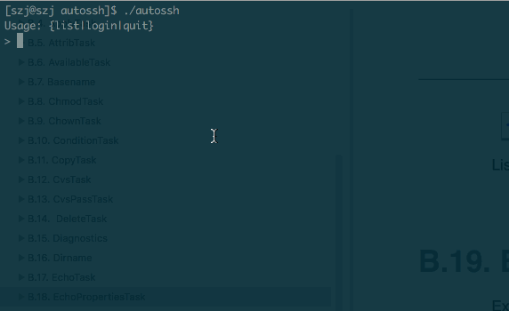

# 一、简介
ssh登录远端Linux服务器,全键盘操作,无需鼠标

+ 支持tab键补全
+ 支持ls|list命令,键入序号登录
+ 灵活的服务器配置(支持密码登录或rsa免密登录)

# 二、环境依赖

```
Linux
yum install -y expect
apt-get install expect
```

# 三、下载 & 安装

```bash
$ git clone https://github.com/Jezzis/autossh.git
$ sudo cp autossh/autossh /usr/local/bin/
```

# 四、配置

## 4.1 服务器连接配置
+ 每一个文件对应一个单独的服务器连接配置,可以按目录自行组织结构
+ 每一个配置文件支持的变量如下:
```bash
HOST            #服务器地址
PORT            #端口
USER            #账号
PASSWORD        #密码
IDENTITY_FILE   #认证文件
```

比如[配置文件]:
```
[szj@szj servers]$ pwd
/Users/szj/workspace/shell/servers
[szj@szj servers]$ tree
.
├── szj
│   ├── sh1
│   ├── sh2
│   ├── sl1
│   ├── sl2
│   └── sl3
```

## 4.2 脚本环境变量

+ 须在脚本中指定服务器配置所在路径
```bash
CONFIG_PATH=path_to_server_config # 服务器配置目录
```

+ 支持公共配置文件
用于指定common为公共配置文件名,那么该目录下所有配置都继承该common文件内的变量,除非配置文件重新定义它们
比如: common配置了用户名,端口,密码 
在将common文件放到servers/a/common,则在目录 servers/a 下所有配置文件将继承common的用户,端口,密码 

```bash
COMMON_CONFIG_FILE=common_file_name # 公共配置文件名
```


# 五、使用

## 5.1 帮助命令


## 5.2 使用Tab键补全


## 5.3 结合ls(list)命令,使用序号登录


